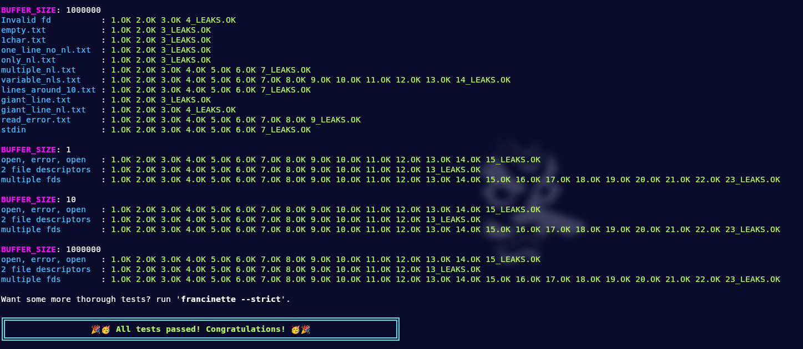

# get_next_line

`get_next_line()` reads text from a file or standard input line by line, returning each line with its newline character. This project also teaching about static variables.

## Tehnologies

## Requirements

- Function should return the line that was read.
If there is nothing else to read or if an error occurred, it should return NULL.
- Function works as expected both when reading a file and when reading from the standard input.
- Returned line should include the terminating \n character
- Add this option to your
compiler call: `-D BUFFER_SIZE=n`
It will define the buffer size for read().
- lseek() is forbidden
- Global variables are forbidden.
- Develop get_next_line() using only one static variable.
- get_next_line() can manage multiple file descriptors at the same time.

## Tests

Test with --strict mode

